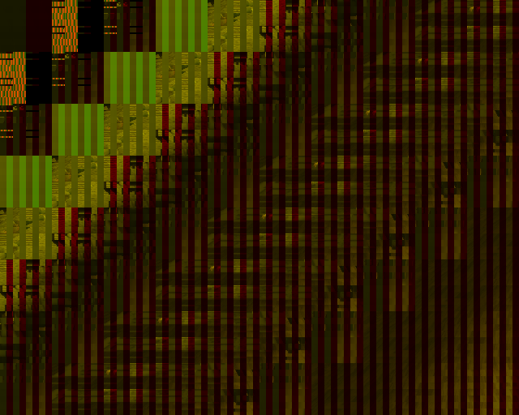

# RD Shuffle effect

## How To Read

### Input

#### Original Format

The format the data was written as in a previous call (FRAME)

#### Sample Format

The format the data is being read as (TEX0) 

#### Base Pointer

The base pointer (TEX0)

### RT

#### Format

The format of the current frame buffer (FRAME)

#### Base Pointer

The base pointer of the current frame buffer (FRAME)

#### Alpha Blending

The blending equation (ALPHA). Not denoted when ABE = 0.

#### Alpha Fix

The fixed alpha value (ALPHA). Not denoted when ABE = 0.

## 18412

### Input

Original Format: `Z32`

Sample Format: `16S`

Base Pointer: `0x2300`


### RT

Format: `16s`

Base Pointer: `0x3640`

Alpha Blending: `N/A`


### Log

```
T:Oth	ID:18412	S:Cache	=> TC: Lookup Target(Color) 1280x1024, hit: 308 (0x3640, C_16S)
T:Error	ID:18412	S:Mid	=> TC: Warning depth format read as color format. Pixels will be scrambled
T:Oth	ID:18412	S:Cache	=> TC depth: dst Depth hit: 6 (0x2300, Z_16S)
T:Error	ID:18412	S:Mid	=> First vertex is  P: 0 => 128    T: 520 => 648
T:Error	ID:18412	S:Mid	=> Color shuffle R => R
T:Error	ID:18412	S:Mid	=> Color shuffle G => G
T:Oth	ID:18412	S:Cache	=> TC: Remove Src Texture: 317 (0x3640)
T:Oth	ID:18412	S:Cache	=> TC: Remove Src Texture: 313 (0x3640)
T:Oth	ID:18412	S:Cache	=> TC: Remove Src Texture: 310 (0x3640)
```

### Vertex Info


### Notes

Read 32 bit depth buffer as 16 bit color data. Sample RG values (texture shuffle-like effect) into 16 bit framebuffer.

## 18413

### Input

Original Format: `16s`

Sample Format: `C32`

Base Pointer: `0x3640`


### RT 

Format: `C32`

Base Pointer: `0x3660`

Alpha Blending: `N\A`


### Log

```
T:Oth	ID:18413	S:Cache	=> TC: Lookup Target(Color) 1280x1024, miss (0x3660, C_32)
T:Oth	ID:18413	S:Cache	=> TC: dst Color hit (full): 308 (0x3640, C_32)
T:Oth	ID:18413	S:Cache	=> TC: Remove Src Texture: 155 (0x3660)
```

### Notes

Read framebuffer of  [18412](#18412) (16 bit) as 32bit texture. New framebuffer (32 bit) at `+20h`.

## 18414

### Input

Original Format: `16s`

Sample Format: `T8`

Base Pointer: `0x3640`

CLUT Format: `C32`

CLUT Pointer: `0x3510`


### RT 

Format: `C32`

Base Pointer: `0x36a0`

Alpha Blending: `(Cs - 0) * Af + 0`

Alpha Fix: `128`


### Log

```
T:Error	ID:18414	S:Mid	=>     0:FixedTEX0 03640 2 19 tw 7=>8 th 7=>7 st (65,1,129,59) uvmax 128,58 wm 2,2 (0,639,0,447)
T:Error	ID:18414	S:Mid	=> FixedTEX0 TW 7=>8, TH 7=>7 wm 2,2
T:Oth	ID:18414	S:Cache	=> TC: Lookup Target(Color) 1280x1024, miss (0x36a0, C_32)
T:Oth	ID:18414	S:Cache	=> TC: dst Color hit (full): 308 (0x3640, P_8)
T:Error	ID:18414	S:Mid	=> Reading RT as a packed-indexed 8 bits format
T:Error	ID:18414	S:Mid	=> Channel shuffle effect detected (2nd shot)
T:Oth	ID:18414	S:Cache	=> TC: Remove Src Texture: 616 (0x36a0)
```

### Notes

Read framebuffer from draw [18412](#18412) (16 bit) as 8 bit format. Write 32 bit at `+60h`.

## 18415

### Input

Original Format: `C32`

Sample Format: `T8`

Base Pointer: `0x3660`


### RT

Format: `C32`

Base Pointer: `0x36a0`

Alpha Blending: `(Cs - 0) * Af + 0`

Alpha Fix: `128`


### Log

```
T:Error	ID:18415	S:Mid	=>     0:FixedTEX0 03660 2 19 tw 7=>8 th 7=>7 st (65,9,129,67) uvmax 128,66 wm 2,2 (0,639,0,447)
T:Error	ID:18415	S:Mid	=> FixedTEX0 TW 7=>8, TH 7=>7 wm 2,2
T:Oth	ID:18415	S:Cache	=> TC: Lookup Target(Color) 1280x1024, hit: 309 (0x36a0, C_32)
T:Oth	ID:18415	S:Cache	=> TC: dst Color hit (full): 311 (0x3660, P_8)
T:Error	ID:18415	S:Mid	=> Reading RT as a packed-indexed 8 bits format
T:Error	ID:18415	S:Mid	=> Channel shuffle effect detected (2nd shot)
```

### Notes

Read framebuffer of draw [18413](#18413) (32 bits) as 8 bit. New 32 bit framebuffer at `+40h`

## 18416

### Input

Original Format: `16s`

Format: `8T`

Base Pointer: `0x3640`


### RT

Format: `C32`

Base Pointer: `0x36a0`

Alpha Blending: `(Cs - 0) * Af + Cd`

Alpha Fix: `128`


### Notes

Read framebuffer from draw [18412](#18412) (16 bit)

## 18417

### Input

Original Format: `C32`

Sample Format: `8T`

Base Pointer: `0x3660`


### RT

Format: `C32`

Base Pointer: `0x36a0`

Alpha Blending: `(Cs - 0) * Af + Cd`

Alpha Fix: `128`


### Notes

Sample is fb of 18413.

## 18418

### Input

Original Format: `c32`

Sample Format: `16s`

Base Pointer: `0x36a0`


### RT

Format: `16s`

Base Pointer: `0x36c0`


### Log

```
T:Error	ID:18418	S:Mid	=> First vertex is  P: 128 => 256    T: 8 => 136
T:Error	ID:18418	S:Mid	=> Color shuffle R => B
T:Error	ID:18418	S:Mid	=> Color shuffle G => A
T:Oth	ID:18418	S:Cache	=> TC: Remove Src Texture: 220 (0x36c0)
```

### Vertex Info

```
UV (0, 0) XYZ (8, 0, 1048575)
UV (8, 64) XYZ (16, 64, 1048575)
UV (16, 0) XYZ (24, 0, 1048575)
UV (24, 64) XYZ (32, 64, 1048575)
UV (32, 0) XYZ (40, 0, 1048575)
UV (40, 64) XYZ (48, 64, 1048575)
UV (48, 0) XYZ (56, 0, 1048575)
UV (56, 64) XYZ (64, 64, 1048575)
```


### Notes

Sample is fb of [18417](#18417). Normal texture shuffle effect, RG => BA.

## 18419

### Input

Original Format: `Unknown`

Sample Format: `16s`

Base Pointer: `0x1180`


### RT

Format: `16s`

Base Pointer: `0x3640`



### Notes

None

## 18420

### Input

Original Format: `16s`

Sample Format: `C32`

Base Pointer: `0x3640`


### RT

Format: `C32`

Base Pointer: `0x3660`


### Notes

Sample is fb of [18419](#18419).

## 18421

### Input

Original Format: `16s`

Sample Format: `8T`

Base Pointer: `0x3640`


### RT

Format: `C32`

Base Pointer: `0x36a0` 

Alpha Blending: `(Cs - 0) * Af + 0`

Alpha Fix: `14`


### Notes

Sample is fb of [18419](#18419).

## 18422

### Input

Original Format: `C32`

Sample Format: `8T`

Base Pointer: `0x3660`


### RT

Format: `C32`

Base Pointer: `0x36a0`

Alpha Blending: `(Cs - 0) * Af + 0`

Alpha Fix: `14`


### Notes

Sample is fb of [18420](#18420).

## 18423

### Input

Original Format: `16s`

Sample Format: `8T`

Base Pointer: `0x3640`


### RT

Format: `C32`

Base Pointer: `0x36a0`

Alpha Blending: `(Cs - 0) * Af + Cd`

Alpha Fix: `75`


### Notes

Input is fb of [18419](#18419).

## 18424

### Input

Original Format: `C32`

Sample Format: `8T`

Base Pointer: `0x3660`


### RT

Format: `C32`

Base Pointer: `0x36a0`

Alpha Blending: `(Cs - 0) * Af + Cd`

Alpha Fix: `75`


### Notes

Sample is fb of [18420](#18420).

## 18425

### Input

Original Format: `16s`

Sample Format: `8T`

Base Pointer: `0x3640`


### RT

Format: `C32`

Base Pointer: `0x36a0`

Alpha Blending: `(Cs - 0) * Af + Cd`

Alpha Fix: `38`


### Notes

Sample is fb of [18419](#18419).

## 18426

### Input

Original Format:

Sample Format: `8T`

Base Pointer: `0x3660`


### RT

Format: `C32`

Base Pointer: `0x36a0`

Alpha Blending: `(Cs - 0) * Af + Cd`

Alpha Fix: `38`


