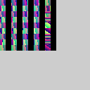
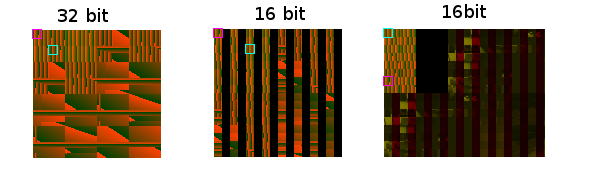

# RD Shuffle effect

## How To Read

### Input

#### Original Format

The format the data was written as in a previous call (FRAME)

#### Sample Format

The format the data is being read as (TEX0) 

#### Base Pointer

The base pointer (TEX0)

### RT

#### Format

The format of the current frame buffer (FRAME)

#### Base Pointer

The base pointer of the current frame buffer (FRAME)

#### Alpha Blending

The blending equation (ALPHA). Not denoted when ABE = 0.

#### Alpha Fix

The fixed alpha value (ALPHA). Not denoted when ABE = 0.

## Summary

18412 Read a 32 bit zbuffer at `0x2300` as `16s` format

18412 Use texture mapping to map `8x8` pixels into a 16 bit framebuffer at `0x3640`

18413 Read framebuffer at `0x3640` in `C32` format

18413 Use texture mapping to remap the texture 2 pixels down in a 32 bit framebuffer at `0x3660`

## 18412

### Input

Original Format: `Z32`

Sample Format: `16S`

Base Pointer: `0x2300`



### RT

Format: `16s`

Base Pointer: `0x3640`


### Log

```
T:Oth	ID:18412	S:Cache	=> TC: Lookup Target(Color) 1280x1024, hit: 308 (0x3640, C_16S)
T:Error	ID:18412	S:Mid	=> TC: Warning depth format read as color format. Pixels will be scrambled
T:Oth	ID:18412	S:Cache	=> TC depth: dst Depth hit: 6 (0x2300, Z_16S)
T:Error	ID:18412	S:Mid	=> First vertex is  P: 0 => 128    T: 520 => 648
T:Error	ID:18412	S:Mid	=> Color shuffle R => R
T:Error	ID:18412	S:Mid	=> Color shuffle G => G
T:Oth	ID:18412	S:Cache	=> TC: Remove Src Texture: 317 (0x3640)
T:Oth	ID:18412	S:Cache	=> TC: Remove Src Texture: 313 (0x3640)
T:Oth	ID:18412	S:Cache	=> TC: Remove Src Texture: 310 (0x3640)
```

### Vertex Info



```
UV (32, 16) XYZ (0, 0, 1048575)
UV (40, 24) XYZ (8, 8, 1048575)
UV (32, 24) XYZ (8, 0, 1048575)
UV (40, 32) XYZ (16, 8, 1048575)
UV (32, 48) XYZ (0, 8, 1048575)
UV (40, 56) XYZ (8, 16, 1048575)
UV (32, 56) XYZ (8, 8, 1048575)
UV (40, 64) XYZ (16, 16, 1048575)
UV (0, 16) XYZ (0, 32, 1048575)
UV (8, 24) XYZ (8, 40, 1048575)
UV (0, 24) XYZ (8, 32, 1048575)
UV (8, 32) XYZ (16, 40, 1048575)
UV (0, 48) XYZ (0, 40, 1048575)
UV (8, 56) XYZ (8, 48, 1048575)
UV (0, 56) XYZ (8, 40, 1048575)
UV (8, 64) XYZ (16, 48, 1048575)
UV (48, 16) XYZ (16, 0, 1048575)
UV (56, 24) XYZ (24, 8, 1048575)
UV (48, 24) XYZ (24, 0, 1048575)
UV (56, 32) XYZ (32, 8, 1048575)
UV (48, 48) XYZ (16, 8, 1048575)
UV (56, 56) XYZ (24, 16, 1048575)
UV (48, 56) XYZ (24, 8, 1048575)
UV (56, 64) XYZ (32, 16, 1048575)
UV (16, 16) XYZ (16, 32, 1048575)
UV (24, 24) XYZ (24, 40, 1048575)
UV (16, 24) XYZ (24, 32, 1048575)
UV (24, 32) XYZ (32, 40, 1048575)
UV (16, 48) XYZ (16, 40, 1048575)
UV (24, 56) XYZ (24, 48, 1048575)
UV (16, 56) XYZ (24, 40, 1048575)
UV (24, 64) XYZ (32, 48, 1048575)
UV (32, 0) XYZ (0, 16, 1048575)
UV (40, 8) XYZ (8, 24, 1048575)
UV (32, 8) XYZ (8, 16, 1048575)
UV (40, 16) XYZ (16, 24, 1048575)
UV (32, 32) XYZ (0, 24, 1048575)
UV (40, 40) XYZ (8, 32, 1048575)
UV (32, 40) XYZ (8, 24, 1048575)
UV (40, 48) XYZ (16, 32, 1048575)
UV (0, 0) XYZ (0, 48, 1048575)
UV (8, 8) XYZ (8, 56, 1048575)
UV (0, 8) XYZ (8, 48, 1048575)
UV (8, 16) XYZ (16, 56, 1048575)
UV (0, 32) XYZ (0, 56, 1048575)
UV (8, 40) XYZ (8, 64, 1048575)
UV (0, 40) XYZ (8, 56, 1048575)
UV (8, 48) XYZ (16, 64, 1048575)
UV (48, 0) XYZ (16, 16, 1048575)
UV (56, 8) XYZ (24, 24, 1048575)
UV (48, 8) XYZ (24, 16, 1048575)
UV (56, 16) XYZ (32, 24, 1048575)
UV (48, 32) XYZ (16, 24, 1048575)
UV (56, 40) XYZ (24, 32, 1048575)
UV (48, 40) XYZ (24, 24, 1048575)
UV (56, 48) XYZ (32, 32, 1048575)
UV (16, 0) XYZ (16, 48, 1048575)
UV (24, 8) XYZ (24, 56, 1048575)
UV (16, 8) XYZ (24, 48, 1048575)
UV (24, 16) XYZ (32, 56, 1048575)
UV (16, 32) XYZ (16, 56, 1048575)
UV (24, 40) XYZ (24, 64, 1048575)
UV (16, 40) XYZ (24, 56, 1048575)
UV (24, 48) XYZ (32, 64, 1048575)
UV (40, 16) XYZ (32, 0, 1048575)
UV (48, 24) XYZ (40, 8, 1048575)
UV (40, 24) XYZ (40, 0, 1048575)
UV (48, 32) XYZ (48, 8, 1048575)
UV (40, 48) XYZ (32, 8, 1048575)
UV (48, 56) XYZ (40, 16, 1048575)
UV (40, 56) XYZ (40, 8, 1048575)
UV (48, 64) XYZ (48, 16, 1048575)
UV (8, 16) XYZ (32, 32, 1048575)
UV (16, 24) XYZ (40, 40, 1048575)
UV (8, 24) XYZ (40, 32, 1048575)
UV (16, 32) XYZ (48, 40, 1048575)
UV (8, 48) XYZ (32, 40, 1048575)
UV (16, 56) XYZ (40, 48, 1048575)
UV (8, 56) XYZ (40, 40, 1048575)
UV (16, 64) XYZ (48, 48, 1048575)
UV (56, 16) XYZ (48, 0, 1048575)
UV (64, 24) XYZ (56, 8, 1048575)
UV (56, 24) XYZ (56, 0, 1048575)
UV (64, 32) XYZ (64, 8, 1048575)
UV (56, 48) XYZ (48, 8, 1048575)
UV (64, 56) XYZ (56, 16, 1048575)
UV (56, 56) XYZ (56, 8, 1048575)
UV (64, 64) XYZ (64, 16, 1048575)
UV (24, 16) XYZ (48, 32, 1048575)
UV (32, 24) XYZ (56, 40, 1048575)
UV (24, 24) XYZ (56, 32, 1048575)
UV (32, 32) XYZ (64, 40, 1048575)
UV (24, 48) XYZ (48, 40, 1048575)
UV (32, 56) XYZ (56, 48, 1048575)
UV (24, 56) XYZ (56, 40, 1048575)
UV (32, 64) XYZ (64, 48, 1048575)
UV (40, 0) XYZ (32, 16, 1048575)
UV (48, 8) XYZ (40, 24, 1048575)
UV (40, 8) XYZ (40, 16, 1048575)
UV (48, 16) XYZ (48, 24, 1048575)
UV (40, 32) XYZ (32, 24, 1048575)
UV (48, 40) XYZ (40, 32, 1048575)
UV (40, 40) XYZ (40, 24, 1048575)
UV (48, 48) XYZ (48, 32, 1048575)
UV (8, 0) XYZ (32, 48, 1048575)
UV (16, 8) XYZ (40, 56, 1048575)
UV (8, 8) XYZ (40, 48, 1048575)
UV (16, 16) XYZ (48, 56, 1048575)
UV (8, 32) XYZ (32, 56, 1048575)
UV (16, 40) XYZ (40, 64, 1048575)
UV (8, 40) XYZ (40, 56, 1048575)
UV (16, 48) XYZ (48, 64, 1048575)
UV (56, 0) XYZ (48, 16, 1048575)
UV (64, 8) XYZ (56, 24, 1048575)
UV (56, 8) XYZ (56, 16, 1048575)
UV (64, 16) XYZ (64, 24, 1048575)
UV (56, 32) XYZ (48, 24, 1048575)
UV (64, 40) XYZ (56, 32, 1048575)
UV (56, 40) XYZ (56, 24, 1048575)
UV (64, 48) XYZ (64, 32, 1048575)
UV (24, 0) XYZ (48, 48, 1048575)
UV (32, 8) XYZ (56, 56, 1048575)
UV (24, 8) XYZ (56, 48, 1048575)
UV (32, 16) XYZ (64, 56, 1048575)
UV (24, 32) XYZ (48, 56, 1048575)
UV (32, 40) XYZ (56, 64, 1048575)
UV (24, 40) XYZ (56, 56, 1048575)
UV (32, 48) XYZ (64, 64, 1048575)
```

### Notes

Read 32 bit depth buffer as 16 bit color data. Sample RG values (texture shuffle-like effect) into a 16 bit framebuffer.

## 18413

### Input

Original Format: `16s`

Sample Format: `C32`

Base Pointer: `0x3640`


### RT 

Format: `C32`

Base Pointer: `0x3660`


### Log

```
T:Oth	ID:18413	S:Cache	=> TC: Lookup Target(Color) 1280x1024, miss (0x3660, C_32)
T:Oth	ID:18413	S:Cache	=> TC: dst Color hit (full): 308 (0x3640, C_32)
T:Oth	ID:18413	S:Cache	=> TC: Remove Src Texture: 155 (0x3660)
```

### Vertex Info

```
UV (0, 0) XYZ (0, 2, 1048575)
UV (64, 32) XYZ (64, 34, 1048575)
```


### Notes

Read framebuffer of  [18412](#18412) (16 bit) as 32bit texture. Copy, move 2 pixels down. New framebuffer (32 bit) at `+20h`.

## 18414

### Input

Original Format: `16s`

Sample Format: `T8`

Base Pointer: `0x3640`

CLUT Format: `C32`

CLUT Pointer: `0x3510`


### RT 

Format: `C32`

Base Pointer: `0x36a0`

Alpha Blending: `(Cs - 0) * Af + 0`

Alpha Fix: `128`


### Log

```
T:Error	ID:18414	S:Mid	=>     0:FixedTEX0 03640 2 19 tw 7=>8 th 7=>7 st (65,1,129,59) uvmax 128,58 wm 2,2 (0,639,0,447)
T:Error	ID:18414	S:Mid	=> FixedTEX0 TW 7=>8, TH 7=>7 wm 2,2
T:Oth	ID:18414	S:Cache	=> TC: Lookup Target(Color) 1280x1024, miss (0x36a0, C_32)
T:Oth	ID:18414	S:Cache	=> TC: dst Color hit (full): 308 (0x3640, P_8)
T:Error	ID:18414	S:Mid	=> Reading RT as a packed-indexed 8 bits format
T:Error	ID:18414	S:Mid	=> Channel shuffle effect detected (2nd shot)
T:Oth	ID:18414	S:Cache	=> TC: Remove Src Texture: 616 (0x36a0)
```

### Vertex Info

```
UV (64, 0) XYZ (0, 0, 1048575)
UV (128, 2) XYZ (64, 2, 1048575)
UV (64, 8) XYZ (0, 4, 1048575)
UV (128, 10) XYZ (64, 6, 1048575)
UV (64, 16) XYZ (0, 8, 1048575)
UV (128, 18) XYZ (64, 10, 1048575)
UV (64, 24) XYZ (0, 12, 1048575)
UV (128, 26) XYZ (64, 14, 1048575)
UV (64, 32) XYZ (0, 16, 1048575)
UV (128, 34) XYZ (64, 18, 1048575)
UV (64, 40) XYZ (0, 20, 1048575)
UV (128, 42) XYZ (64, 22, 1048575)
UV (64, 48) XYZ (0, 24, 1048575)
UV (128, 50) XYZ (64, 26, 1048575)
UV (64, 56) XYZ (0, 28, 1048575)
UV (128, 58) XYZ (64, 30, 1048575)
```


### Notes

Read framebuffer from draw [18412](#18412) (16 bit) as 8 bit format. Write 32 bit at `+60h`.

## 18415

### Input

Original Format: `C32`

Sample Format: `T8`

Base Pointer: `0x3660`

CLUT Format: `c32`

CLUT Base Pointer: `0x3510`


### RT

Format: `C32`

Base Pointer: `0x36a0`

Alpha Blending: `(Cs - 0) * Af + 0`

Alpha Fix: `128`


### Log

```
T:Error	ID:18415	S:Mid	=>     0:FixedTEX0 03660 2 19 tw 7=>8 th 7=>7 st (65,9,129,67) uvmax 128,66 wm 2,2 (0,639,0,447)
T:Error	ID:18415	S:Mid	=> FixedTEX0 TW 7=>8, TH 7=>7 wm 2,2
T:Oth	ID:18415	S:Cache	=> TC: Lookup Target(Color) 1280x1024, hit: 309 (0x36a0, C_32)
T:Oth	ID:18415	S:Cache	=> TC: dst Color hit (full): 311 (0x3660, P_8)
T:Error	ID:18415	S:Mid	=> Reading RT as a packed-indexed 8 bits format
T:Error	ID:18415	S:Mid	=> Channel shuffle effect detected (2nd shot)
```

### Vertex Info

```
UV (64, 8) XYZ (0, 2, 1048575)
UV (128, 10) XYZ (64, 4, 1048575)
UV (64, 16) XYZ (0, 6, 1048575)
UV (128, 18) XYZ (64, 8, 1048575)
UV (64, 24) XYZ (0, 10, 1048575)
UV (128, 26) XYZ (64, 12, 1048575)
UV (64, 32) XYZ (0, 14, 1048575)
UV (128, 34) XYZ (64, 16, 1048575)
UV (64, 40) XYZ (0, 18, 1048575)
UV (128, 42) XYZ (64, 20, 1048575)
UV (64, 48) XYZ (0, 22, 1048575)
UV (128, 50) XYZ (64, 24, 1048575)
UV (64, 56) XYZ (0, 26, 1048575)
UV (128, 58) XYZ (64, 28, 1048575)
UV (64, 64) XYZ (0, 30, 1048575)
UV (128, 66) XYZ (64, 32, 1048575)
```


### Notes

Read framebuffer of draw [18413](#18413) (32 bits) as 8 bit. New 32 bit framebuffer at `+40h`. Channel shuffle.

## 18416

### Input

Original Format: `16s`

Format: `8T`

Base Pointer: `0x3640`

CLUT Format: `c32`

CLUT Base Pointer: `0x34f0`


### RT

Format: `C32`

Base Pointer: `0x36a0`

Alpha Blending: `(Cs - 0) * Af + Cd`

Alpha Fix: `128`


### Log

```
T:Oth	ID:18416	S:Cache	=> TC: Lookup Target(Color) 1280x1024, hit: 309 (0x36a0, C_32)
T:Oth	ID:18416	S:Cache	=> TC: dst Color hit (full): 308 (0x3640, P_8)
T:Error	ID:18416	S:Mid	=> Reading RT as a packed-indexed 8 bits format
T:Error	ID:18416	S:Mid	=> Channel shuffle effect detected (2nd shot)
```


### Vertex Info

```
UV (0, 6) XYZ (0, 2, 1048575)
UV (64, 8) XYZ (64, 4, 1048575)
UV (0, 14) XYZ (0, 6, 1048575)
UV (64, 16) XYZ (64, 8, 1048575)
UV (0, 22) XYZ (0, 10, 1048575)
UV (64, 24) XYZ (64, 12, 1048575)
UV (0, 30) XYZ (0, 14, 1048575)
UV (64, 32) XYZ (64, 16, 1048575)
UV (0, 38) XYZ (0, 18, 1048575)
UV (64, 40) XYZ (64, 20, 1048575)
UV (0, 46) XYZ (0, 22, 1048575)
UV (64, 48) XYZ (64, 24, 1048575)
UV (0, 54) XYZ (0, 26, 1048575)
UV (64, 56) XYZ (64, 28, 1048575)
UV (0, 62) XYZ (0, 30, 1048575)
UV (64, 64) XYZ (64, 32, 1048575)
```


### Notes

Read framebuffer from draw [18412](#18412) (16 bit). Channel shuffle.

## 18417

### Input

Original Format: `C32`

Sample Format: `8T`

Base Pointer: `0x3660`


### RT

Format: `C32`

Base Pointer: `0x36a0`

Alpha Blending: `(Cs - 0) * Af + Cd`

Alpha Fix: `128`


### Notes

Sample is fb of [18413](#18413).

## 18418

### Input

Original Format: `c32`

Sample Format: `16s`

Base Pointer: `0x36a0`


### RT

Format: `16s`

Base Pointer: `0x36c0`


### Log

```
T:Error	ID:18418	S:Mid	=> First vertex is  P: 128 => 256    T: 8 => 136
T:Error	ID:18418	S:Mid	=> Color shuffle R => B
T:Error	ID:18418	S:Mid	=> Color shuffle G => A
T:Oth	ID:18418	S:Cache	=> TC: Remove Src Texture: 220 (0x36c0)
```

### Vertex Info

```
UV (0, 0) XYZ (8, 0, 1048575)
UV (8, 64) XYZ (16, 64, 1048575)
UV (16, 0) XYZ (24, 0, 1048575)
UV (24, 64) XYZ (32, 64, 1048575)
UV (32, 0) XYZ (40, 0, 1048575)
UV (40, 64) XYZ (48, 64, 1048575)
UV (48, 0) XYZ (56, 0, 1048575)
UV (56, 64) XYZ (64, 64, 1048575)
```


### Notes

Sample is fb of [18417](#18417). Normal texture shuffle effect, RG => BA.

## 18419

### Input

Original Format: `Unknown`

Sample Format: `16s`

Base Pointer: `0x1180`


### RT

Format: `16s`

Base Pointer: `0x3640`


### Notes

### Vertex Info

```
UV (0, 0) XYZ (0, 0, 1048575)
UV (8, 8) XYZ (8, 8, 1048575)
UV (0, 8) XYZ (8, 0, 1048575)
UV (8, 16) XYZ (16, 8, 1048575)
UV (0, 32) XYZ (0, 8, 1048575)
UV (8, 40) XYZ (8, 16, 1048575)
UV (0, 40) XYZ (8, 8, 1048575)
UV (8, 48) XYZ (16, 16, 1048575)
UV (32, 0) XYZ (0, 32, 1048575)
UV (40, 8) XYZ (8, 40, 1048575)
UV (32, 8) XYZ (8, 32, 1048575)
UV (40, 16) XYZ (16, 40, 1048575)
UV (32, 32) XYZ (0, 40, 1048575)
UV (40, 40) XYZ (8, 48, 1048575)
UV (32, 40) XYZ (8, 40, 1048575)
UV (40, 48) XYZ (16, 48, 1048575)
UV (16, 0) XYZ (16, 0, 1048575)
UV (24, 8) XYZ (24, 8, 1048575)
UV (16, 8) XYZ (24, 0, 1048575)
UV (24, 16) XYZ (32, 8, 1048575)
UV (16, 32) XYZ (16, 8, 1048575)
UV (24, 40) XYZ (24, 16, 1048575)
UV (16, 40) XYZ (24, 8, 1048575)
UV (24, 48) XYZ (32, 16, 1048575)
UV (48, 0) XYZ (16, 32, 1048575)
UV (56, 8) XYZ (24, 40, 1048575)
UV (48, 8) XYZ (24, 32, 1048575)
UV (56, 16) XYZ (32, 40, 1048575)
UV (48, 32) XYZ (16, 40, 1048575)
UV (56, 40) XYZ (24, 48, 1048575)
UV (48, 40) XYZ (24, 40, 1048575)
UV (56, 48) XYZ (32, 48, 1048575)
UV (0, 16) XYZ (0, 16, 1048575)
UV (8, 24) XYZ (8, 24, 1048575)
UV (0, 24) XYZ (8, 16, 1048575)
UV (8, 32) XYZ (16, 24, 1048575)
UV (0, 48) XYZ (0, 24, 1048575)
UV (8, 56) XYZ (8, 32, 1048575)
UV (0, 56) XYZ (8, 24, 1048575)
UV (8, 64) XYZ (16, 32, 1048575)
UV (32, 16) XYZ (0, 48, 1048575)
UV (40, 24) XYZ (8, 56, 1048575)
UV (32, 24) XYZ (8, 48, 1048575)
UV (40, 32) XYZ (16, 56, 1048575)
UV (32, 48) XYZ (0, 56, 1048575)
UV (40, 56) XYZ (8, 64, 1048575)
UV (32, 56) XYZ (8, 56, 1048575)
UV (40, 64) XYZ (16, 64, 1048575)
UV (16, 16) XYZ (16, 16, 1048575)
UV (24, 24) XYZ (24, 24, 1048575)
UV (16, 24) XYZ (24, 16, 1048575)
UV (24, 32) XYZ (32, 24, 1048575)
UV (16, 48) XYZ (16, 24, 1048575)
UV (24, 56) XYZ (24, 32, 1048575)
UV (16, 56) XYZ (24, 24, 1048575)
UV (24, 64) XYZ (32, 32, 1048575)
UV (48, 16) XYZ (16, 48, 1048575)
UV (56, 24) XYZ (24, 56, 1048575)
UV (48, 24) XYZ (24, 48, 1048575)
UV (56, 32) XYZ (32, 56, 1048575)
UV (48, 48) XYZ (16, 56, 1048575)
UV (56, 56) XYZ (24, 64, 1048575)
UV (48, 56) XYZ (24, 56, 1048575)
UV (56, 64) XYZ (32, 64, 1048575)
UV (8, 0) XYZ (32, 0, 1048575)
UV (16, 8) XYZ (40, 8, 1048575)
UV (8, 8) XYZ (40, 0, 1048575)
UV (16, 16) XYZ (48, 8, 1048575)
UV (8, 32) XYZ (32, 8, 1048575)
UV (16, 40) XYZ (40, 16, 1048575)
UV (8, 40) XYZ (40, 8, 1048575)
UV (16, 48) XYZ (48, 16, 1048575)
UV (40, 0) XYZ (32, 32, 1048575)
UV (48, 8) XYZ (40, 40, 1048575)
UV (40, 8) XYZ (40, 32, 1048575)
UV (48, 16) XYZ (48, 40, 1048575)
UV (40, 32) XYZ (32, 40, 1048575)
UV (48, 40) XYZ (40, 48, 1048575)
UV (40, 40) XYZ (40, 40, 1048575)
UV (48, 48) XYZ (48, 48, 1048575)
UV (24, 0) XYZ (48, 0, 1048575)
UV (32, 8) XYZ (56, 8, 1048575)
UV (24, 8) XYZ (56, 0, 1048575)
UV (32, 16) XYZ (64, 8, 1048575)
UV (24, 32) XYZ (48, 8, 1048575)
UV (32, 40) XYZ (56, 16, 1048575)
UV (24, 40) XYZ (56, 8, 1048575)
UV (32, 48) XYZ (64, 16, 1048575)
UV (56, 0) XYZ (48, 32, 1048575)
UV (64, 8) XYZ (56, 40, 1048575)
UV (56, 8) XYZ (56, 32, 1048575)
UV (64, 16) XYZ (64, 40, 1048575)
UV (56, 32) XYZ (48, 40, 1048575)
UV (64, 40) XYZ (56, 48, 1048575)
UV (56, 40) XYZ (56, 40, 1048575)
UV (64, 48) XYZ (64, 48, 1048575)
UV (8, 16) XYZ (32, 16, 1048575)
UV (16, 24) XYZ (40, 24, 1048575)
UV (8, 24) XYZ (40, 16, 1048575)
UV (16, 32) XYZ (48, 24, 1048575)
UV (8, 48) XYZ (32, 24, 1048575)
UV (16, 56) XYZ (40, 32, 1048575)
UV (8, 56) XYZ (40, 24, 1048575)
UV (16, 64) XYZ (48, 32, 1048575)
UV (40, 16) XYZ (32, 48, 1048575)
UV (48, 24) XYZ (40, 56, 1048575)
UV (40, 24) XYZ (40, 48, 1048575)
UV (48, 32) XYZ (48, 56, 1048575)
UV (40, 48) XYZ (32, 56, 1048575)
UV (48, 56) XYZ (40, 64, 1048575)
UV (40, 56) XYZ (40, 56, 1048575)
UV (48, 64) XYZ (48, 64, 1048575)
UV (24, 16) XYZ (48, 16, 1048575)
UV (32, 24) XYZ (56, 24, 1048575)
UV (24, 24) XYZ (56, 16, 1048575)
UV (32, 32) XYZ (64, 24, 1048575)
UV (24, 48) XYZ (48, 24, 1048575)
UV (32, 56) XYZ (56, 32, 1048575)
UV (24, 56) XYZ (56, 24, 1048575)
UV (32, 64) XYZ (64, 32, 1048575)
UV (56, 16) XYZ (48, 48, 1048575)
UV (64, 24) XYZ (56, 56, 1048575)
UV (56, 24) XYZ (56, 48, 1048575)
UV (64, 32) XYZ (64, 56, 1048575)
UV (56, 48) XYZ (48, 56, 1048575)
UV (64, 56) XYZ (56, 64, 1048575)
UV (56, 56) XYZ (56, 56, 1048575)
UV (64, 64) XYZ (64, 64, 1048575)
```


### Log

```
T:Oth	ID:18419	S:Cache	=> TC: Lookup Target(Color) 1280x1024, hit: 308 (0x3640, C_16S)
T:Oth	ID:18419	S:Cache	=> TC: dst Color hit (full): 5 (0x1180, C_16S)
T:Error	ID:18419	S:Mid	=> First vertex is  P: 0 => 128    T: 8 => 136
T:Error	ID:18419	S:Mid	=> Color shuffle R => R
T:Error	ID:18419	S:Mid	=> Color shuffle G => G
T:Oth	ID:18419	S:Cache	=> TC: Remove Src Texture: 317 (0x3640)
T:Oth	ID:18419	S:Cache	=> TC: Remove Src Texture: 313 (0x3640)
T:Oth	ID:18419	S:Cache	=> TC: Remove Src Texture: 310 (0x3640)
```


### Notes

Similar effect to [18412](#18412)

## 18420

### Input

Original Format: `16s`

Sample Format: `C32`

Base Pointer: `0x3640`


### RT

Format: `C32`

Base Pointer: `0x3660`


### Notes

Sample is fb of [18419](#18419).

## 18421

### Input

Original Format: `16s`

Sample Format: `8T`

Base Pointer: `0x3640`


### RT

Format: `C32`

Base Pointer: `0x36a0` 

Alpha Blending: `(Cs - 0) * Af + 0`

Alpha Fix: `14`


### Notes

Sample is fb of [18419](#18419).

## 18422

### Input

Original Format: `C32`

Sample Format: `8T`

Base Pointer: `0x3660`


### RT

Format: `C32`

Base Pointer: `0x36a0`

Alpha Blending: `(Cs - 0) * Af + 0`

Alpha Fix: `14`


### Notes

Sample is fb of [18420](#18420).

## 18423

### Input

Original Format: `16s`

Sample Format: `8T`

Base Pointer: `0x3640`


### RT

Format: `C32`

Base Pointer: `0x36a0`

Alpha Blending: `(Cs - 0) * Af + Cd`

Alpha Fix: `75`


### Notes

Input is fb of [18419](#18419).

## 18424

### Input

Original Format: `C32`

Sample Format: `8T`

Base Pointer: `0x3660`


### RT

Format: `C32`

Base Pointer: `0x36a0`

Alpha Blending: `(Cs - 0) * Af + Cd`

Alpha Fix: `75`


### Notes

Sample is fb of [18420](#18420).

## 18425

### Input

Original Format: `16s`

Sample Format: `8T`

Base Pointer: `0x3640`


### RT

Format: `C32`

Base Pointer: `0x36a0`

Alpha Blending: `(Cs - 0) * Af + Cd`

Alpha Fix: `38`


### Notes

Sample is fb of [18419](#18419).

## 18426

### Input

Original Format:

Sample Format: `8T`

Base Pointer: `0x3660`


### RT

Format: `C32`

Base Pointer: `0x36a0`

Alpha Blending: `(Cs - 0) * Af + Cd`

Alpha Fix: `38`


